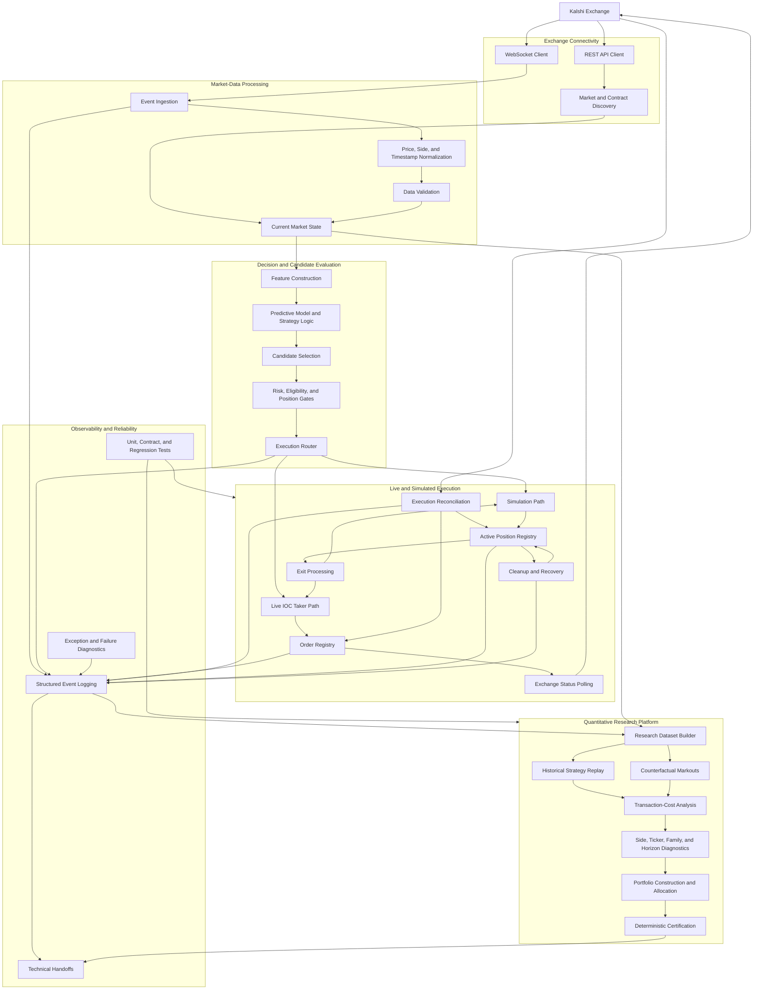
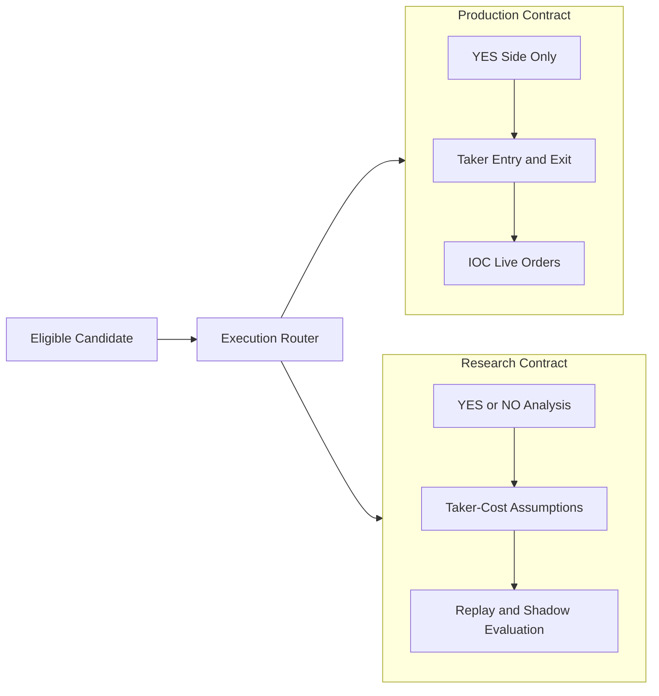
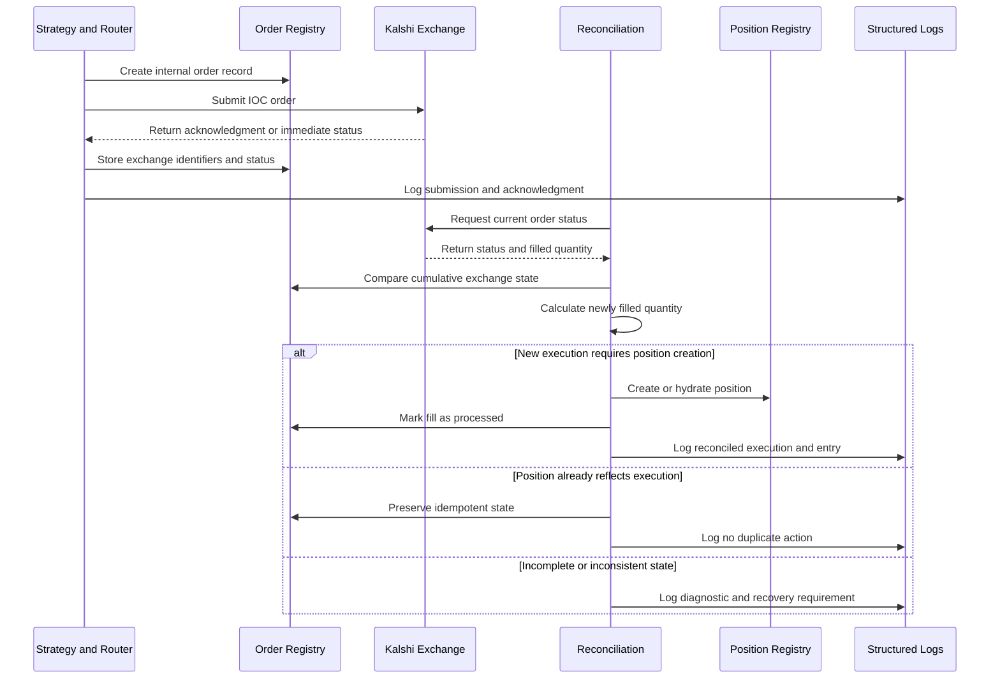
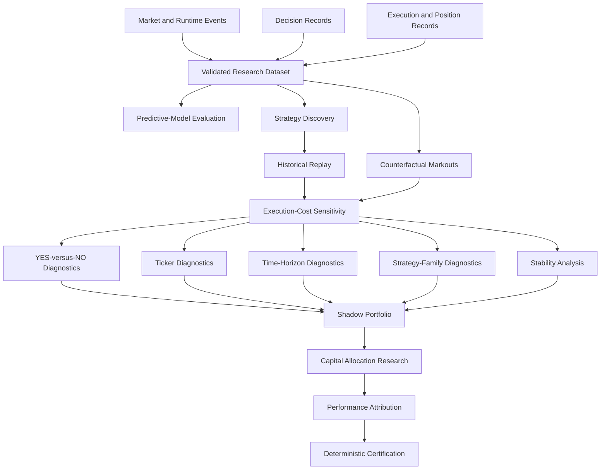

# System Architecture

## Kalshi Prediction-Market Execution and Quantitative Research Platform

This document presents a sanitized, high-level architecture of the independently developed Kalshi prediction-market platform.

The private production system contains additional implementation details, configuration, strategy logic, and operational components that are intentionally excluded from this public case study.

## Architecture Objectives

The platform was designed to support four connected objectives:

1. Receive and validate live prediction-market data.
2. Evaluate market opportunities and manage order execution.
3. Reconcile exchange activity with internal position state.
4. convert runtime and historical evidence into reproducible quantitative research.

A central design principle was separating the production trading path from the experimental research path.

## High-Level Platform Architecture



## Architecture Layers

## 1. Exchange Connectivity

The connectivity layer communicates with Kalshi through separate REST and WebSocket workflows.

### REST responsibilities

* Market and contract discovery
* Order submission
* Order-status retrieval
* Account-authorized exchange operations
* Reconciliation requests

### WebSocket responsibilities

* Real-time market-event ingestion
* Quote updates
* Trade-event updates
* Continuous market-state refresh
* Timestamped event processing

Separating REST operations from streaming market data allowed order activity and market activity to be analyzed independently.

## 2. Market-Data Processing

Raw exchange messages were not sent directly into strategy logic.

The processing layer performed:

* Schema inspection
* Side normalization
* Price normalization
* Timestamp handling
* Missing-value checks
* Quote validation
* Current-state updates
* Diagnostic logging

This reduced the likelihood that malformed, stale, or incomplete data would silently influence a trade decision.

## 3. Decision and Candidate Evaluation

The decision layer converted market state into a potential action.

The generalized path was:

```text
Market state
    ↓
Feature construction
    ↓
Predictive model and strategy rules
    ↓
Candidate side and price
    ↓
Eligibility and risk gates
    ↓
Execution router
```

Candidate evaluation could incorporate:

* Model probability
* Expected value
* Expected price movement
* Market side
* Confidence
* Quote quality
* Position availability
* Existing exposure
* Strategy-specific conditions
* Execution-mode requirements

Not every computed signal reached the order-submission path. Candidates could be rejected by eligibility, risk, position, or routing controls.

## 4. Execution Router

The router separated simulated activity from live exchange activity.



The private production system and research platform used intentionally different contracts.

### Production contract

* YES-side execution only
* Taker-only entry
* Taker-only exit
* IOC live orders
* Live position and exposure controls

### Research contract

* YES or NO analysis allowed
* Taker-cost assumptions for entry and exit
* Historical replay
* Counterfactual analysis
* Shadow portfolio evaluation
* No automatic modification of the production contract

This separation prevented experimental findings from silently changing live behavior.

## 5. Order Registry

The order registry was the internal record of submitted and reconciled exchange orders.

Representative responsibilities included:

* Internal trade identifier
* Exchange order identifier
* Ticker
* Side
* Price
* Requested quantity
* Filled quantity
* Remaining quantity
* Submission status
* Acknowledgment status
* Execution status
* Pending-fill context
* Entry-versus-exit classification
* Position association

The registry provided the bridge between an exchange order and the application state that depended on it.

## 6. Execution Reconciliation

Execution reconciliation compared exchange-reported activity with internal records.



A central reconciliation requirement was idempotency.

Repeatedly processing the same exchange execution should not:

* Create duplicate positions
* Double-count filled quantity
* Produce duplicate P&L
* Trigger multiple exits
* Corrupt per-ticker exposure

At the same time, reconciliation needed to restore a missing internal position when valid exchange evidence showed that an execution had occurred.

## 7. Position Management

The active-position registry represented application-recognized exposure.

Position-management responsibilities included:

* Position creation
* Quantity tracking
* Entry-price storage
* Ticker association
* Side association
* Entry timestamp
* Exit eligibility
* Per-ticker position controls
* Registry synchronization
* Cleanup
* Ghost-position prevention

A separate ticker-level structure supported controls such as limiting concurrent positions in the same market.

## 8. Exit Processing

Exit processing reused many of the same lifecycle concepts as entry processing:

* Exit decision
* Price resolution
* Order submission
* Exchange acknowledgment
* Fill reconciliation
* Position reduction or closure
* Registry cleanup
* P&L calculation
* Final event logging

Earlier project work resolved several exit-related problems before entry conversion became the primary investigation.

These included:

* Exit-submission failures
* Exit acknowledgment latency
* Position cleanup
* Ghost-position removal
* Registry synchronization

## 9. Observability

Structured logging was essential because the platform crossed multiple asynchronous state boundaries.

Representative diagnostic events recorded:

* Candidate generation
* Candidate rejection
* Side and price resolution
* Router decisions
* Order-registry creation
* Exchange acknowledgment
* Order reconciliation
* Filled quantity
* Active-position state
* Position creation
* Exit activity
* Cleanup actions
* Exceptions and recovery attempts

Stable identifiers were needed to connect events across the lifecycle.

```text
Candidate
    ↓ trade_id
Order submission
    ↓ client_order_id
Exchange acknowledgment
    ↓ exchange_order_id
Reconciliation
    ↓ position_id
Position and exit lifecycle
```

Without consistent identifiers, aggregate counts could reveal a problem but could not reliably explain an individual order’s outcome.

## 10. Research Data Flow

The research platform consumed structured outputs from market data, decision logic, execution activity, and diagnostics.



## 11. Deterministic Research Validation

The research platform incorporated reproducibility controls such as:

* Fixed source inputs
* Validation assertions
* Expected row counts
* Schema checks
* Source-file hashes
* Output-file hashes
* Diagnostic signatures
* Repeated deterministic runs
* Certified output directories
* Explicit pass-or-fail status messages

The objective was to distinguish a repeatable analytical result from an output that changed because of hidden state, nondeterministic ordering, or accidental file differences.

## 12. Technical Handoffs

Detailed handoffs were used to preserve continuity across the project.

A typical handoff recorded:

* Current system state
* Completed work
* Confirmed fixes
* Observed metrics
* Relevant source paths
* Unresolved defects
* Highest-value next investigation
* Production constraints
* Research constraints
* Validation requirements
* Known risks

These handoffs became an important form of system documentation for a large, evolving codebase.

## Private Production Components Excluded

This architecture intentionally omits:

* Credentials and authentication implementation
* Exact strategy formulas
* Proprietary thresholds
* Full order-routing logic
* Complete risk controls
* Private server and deployment configuration
* Account-specific state
* Raw production logs
* Complete source-file relationships
* Private datasets

The diagrams describe the system’s functional architecture without reproducing the complete private implementation.

## Architecture Lessons

Several general lessons emerged from the project:

### A trading signal is only one component

Market data, execution, reconciliation, position state, and transaction costs can determine whether a signal produces a real economic result.

### Exchange state and application state are different

An exchange can execute an order while the application remains incomplete or inconsistent.

### Research and production should remain separated

Experimental side selection, strategy discovery, or cost assumptions should not silently modify the production trading contract.

### Simulation requires execution realism

A strategy simulation that assumes unrealistic fills can materially overstate deployable performance.

### Reconciliation must be idempotent

Recovery logic must repair missing state without duplicating fills or positions.

### Observability is part of the architecture

Structured identifiers and lifecycle logs are required for investigating asynchronous systems.

### Negative evidence must be preserved

A system that accurately identifies non-robust strategies provides more value than one that promotes misleading historical results.

## Related Documentation

* [Institutional Overview](institutional-overview.md)
* [Live Execution Debugging Case Study](execution-debugging-case-study.md)
* [Repository Security Policy](../SECURITY.md)
* [Main Project Overview](../README.md)

## Contact

**Ryan Eblen**
AI-Assisted Python Developer
Prediction-Market Systems Researcher
Louisville, Kentucky
[ryan.eblen.work@gmail.com](mailto:ryan.eblen.work@gmail.com)
