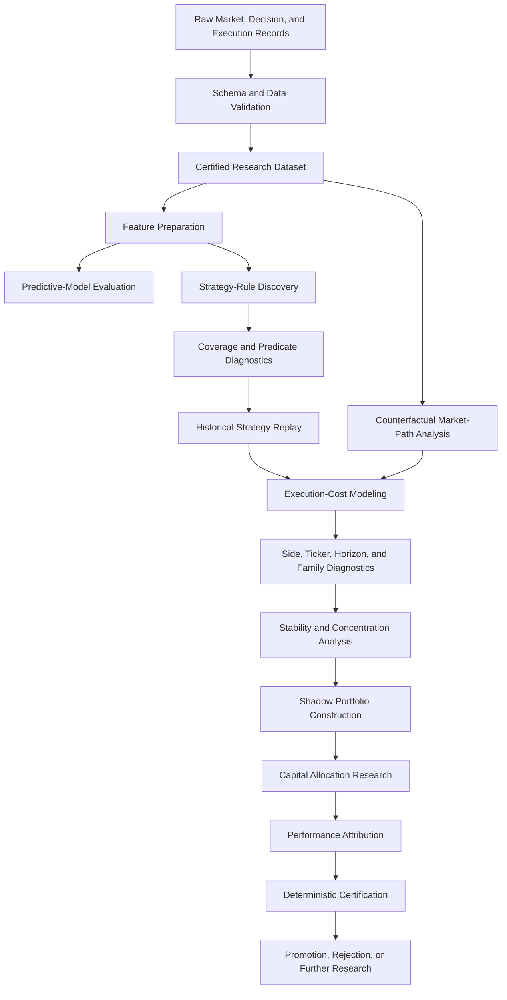

# Quantitative Research Methodology

## Kalshi Prediction-Market Research Platform

This document explains the research process used to evaluate predictive models, systematic trading rules, execution assumptions, and portfolio-level results within the independently developed Kalshi prediction-market platform.

The methodology was designed to answer a central question:

> Did an observed historical pattern represent a reproducible, executable, and economically meaningful opportunity after realistic costs and implementation constraints?

The research process did not assume that model quality, favorable historical outcomes, or simulated fills were sufficient evidence of deployable profitability.

## Methodology Principles

The research platform followed several core principles:

1. Preserve a clear distinction between production trading and experimental research.
2. Validate source data before performing strategy analysis.
3. Separate predictive performance from economic performance.
4. Evaluate execution costs explicitly.
5. Test YES and NO outcomes separately.
6. Distinguish negative evidence from insufficient evidence.
7. Prevent data leakage and look-ahead bias.
8. Preserve deterministic and reproducible outputs.
9. Avoid treating simulated results as live results.
10. Document limitations and adverse findings.

## Research and Production Separation

The production and research environments intentionally used different contracts.

### Production contract

* YES-side execution only
* Taker-only entry
* Taker-only exit
* IOC live orders
* Live position and exposure controls
* No automatic adoption of experimental research logic

### Research contract

* YES or NO side could be evaluated
* Taker-cost assumptions applied to both entry and exit
* Historical replay permitted
* Counterfactual market-path analysis permitted
* Shadow portfolio analysis permitted
* No authority to modify production execution automatically

This separation allowed the research platform to investigate both market sides and alternative strategy rules without silently changing the live system.

## Research Pipeline

## 1. Source Data

The principal research dataset contained:

| Dataset measure                             |              Value |
| ------------------------------------------- | -----------------: |
| Market decisions                            |             33,605 |
| Research features                           |                 32 |
| Primary label                               | `label_profitable` |
| Positive observations                       |                204 |
| Candidate strategy configurations evaluated |                154 |

The dataset combined structured information from:

* Market state
* Quote and trade events
* Model outputs
* Strategy decisions
* Entry assumptions
* Execution observations
* Position outcomes
* Profitability labels
* Side and ticker information
* Time-horizon information

The positive class was rare, which made class imbalance a central modeling and evaluation concern.

## 2. Data Validation

Before modeling or strategy analysis, the research process checked:

* Expected schema
* Required columns
* Row counts
* Data types
* Missing values
* Duplicate records
* Invalid prices
* Invalid sides
* Invalid timestamps
* Label consistency
* Join coverage
* Source-file identity
* Deterministic ordering

Invalid or incomplete observations were not silently converted into favorable outcomes.

Where source evidence was unavailable, the system recorded an evidence limitation rather than inventing a result.

## 3. Feature Preparation

The research features represented decision-time information intended to describe market opportunity, model confidence, execution conditions, or expected movement.

The preparation process included:

* Numeric type validation
* Missing-value analysis
* Feature-range checks
* Correlation review
* Multicollinearity review
* Label separation
* Time-order awareness
* Leakage inspection
* Train-validation-test separation

Features were reviewed to ensure that information generated after the decision was not accidentally used to predict the decision outcome.

## 4. Predictive-Model Evaluation

The principal certified predictive model used logistic regression.

The model was evaluated with metrics including:

* ROC-AUC
* Precision-recall AUC
* Accuracy
* Precision
* Recall
* F1 score
* Confusion matrix
* Probability calibration
* Expected calibration error
* Threshold sensitivity
* Class-imbalance effects

Selected certified validation results included:

| Metric                          |                Result |
| ------------------------------- | --------------------: |
| Validation ROC-AUC              |                0.9823 |
| Validation precision-recall AUC |                0.3435 |
| Accuracy                        |                0.9957 |
| Recall                          |                0.3929 |
| F1 score                        |                0.4314 |
| Expected calibration error      | Approximately 0.00044 |
| Selected threshold              |                  0.23 |

These results showed strong discrimination within the evaluated dataset.

They did not establish that a trading strategy based on the model would remain profitable after:

* Entry cost
* Exit cost
* Spread
* Execution delay
* Fill uncertainty
* Market selection
* Position constraints

The methodology therefore treated predictive-model evaluation as one research layer rather than the final economic decision.

## 5. Strategy Discovery

The research system generated systematic strategy configurations from eligible feature conditions and rule combinations.

The process included:

* Eligible feature selection
* Threshold construction
* Predicate definition
* Rule combinations
* Strategy identifiers
* Coverage analysis
* Match-count validation
* Duplicate-rule detection
* Strategy-family classification

A total of 154 systematic strategy configurations were evaluated.

Each strategy was treated as a documented decision rule rather than a free-form retrospective explanation.

## 6. Predicate and Coverage Diagnostics

Before evaluating economic performance, the platform measured how each rule behaved across the dataset.

Diagnostics included:

* Rows evaluated
* Rows matched
* Coverage percentage
* Predicate pass count
* Feature threshold
* Operator
* Strategy identifier
* Rule identifier
* Combination identifier

This step helped identify:

* Rules that matched almost everything
* Rules that matched too little
* Overly broad predicates
* Overly narrow predicates
* Duplicate or functionally equivalent strategies
* Unexpected coverage caused by implementation errors

Coverage was reviewed before profitability conclusions were accepted.

## 7. Historical Replay

Historical replay applied each strategy rule to decision-time observations and reconstructed the strategy’s historical eligibility.

The replay process separated:

* Strategy match
* Market-side eligibility
* Available execution evidence
* Historical taker evidence
* Counterfactual requirements
* Invalid or missing source evidence

Selected replay-scale results included:

| Replay measure                                     | Approximate count |
| -------------------------------------------------- | ----------------: |
| Historical strategy matches                        |           967,800 |
| YES-side eligibility observations                  |           174,664 |
| NO-side eligibility observations                   |             9,912 |
| Historical YES taker-evidence observations         |            41,958 |
| Historical taker outcomes                          |             8,507 |
| YES observations requiring counterfactual analysis |           132,706 |

A strategy match was not automatically counted as an executable trade.

The system required appropriate price-path or execution evidence before an economic result was assigned.

## 8. Counterfactual Market-Path Analysis

Where direct historical taker evidence was unavailable, the platform used validated quote events to examine what happened after a decision.

The counterfactual process included:

* Decision-time quote selection
* Quote timestamp validation
* Side-aware price handling
* Future market-path search
* Markout-horizon selection
* Missing-path detection
* Invalid-quote rejection
* Source-coverage measurement

Selected primary-analysis counts included:

| Counterfactual measure           |                 Count |
| -------------------------------- | --------------------: |
| Eligible primary decisions       |                24,896 |
| Valid quote events               |     More than 102,000 |
| Primary markout observations     | Approximately 100,000 |
| Selected invalid quotes          |                     0 |
| Source invalid quotes identified |                     4 |

The primary market-price path was certified for the referenced analysis.

Liquidity-path evidence was not considered fully available, and the platform preserved that limitation.

## 9. Execution Assumptions

The research platform used taker-oriented execution assumptions because live system evidence indicated that taker execution was more relevant to the production architecture.

Research entry and exit assumptions therefore included:

* Taker entry
* Taker exit
* Side-aware prices
* Explicit transaction-cost levels
* Fill-evidence requirements
* No assumption of free execution
* No automatic maker rebate
* No use of an unavailable liquidity path as confirmed evidence

Historical taker observations included 765 closed observations in one economics dataset.

Selected descriptive results were:

| Historical taker measure |                      Result |
| ------------------------ | --------------------------: |
| Closed observations      |                         765 |
| Mean entry price         |        Approximately 0.3015 |
| Median entry price       |                        0.27 |
| Mean exit price          |        Approximately 0.3841 |
| Median exit price        |                        0.28 |
| Mean observed P&L        |        Approximately 0.0626 |
| Median observed P&L      |                       -0.02 |
| Mean observed hold duration — closed taker-evidence subset | Approximately 0.364 seconds |

The sub-second mean hold duration applied to this specific set of 765 closed historical taker observations and should not be interpreted as the universal holding period of every strategy evaluated by the platform. It demonstrates why execution latency, quote movement, immediate fill interpretation, and round-trip transaction costs were central to the research.The positive mean and negative median indicated a skewed outcome distribution and reinforced the need for segmentation, sample-size controls, and cost analysis.

## 10. Transaction-Cost Sensitivity

Strategy economics were tested across multiple execution-cost assumptions.

The purpose was to determine whether apparent historical performance survived progressively less favorable execution.

The process examined:

* Entry cost
* Exit cost
* Combined round-trip cost
* Side-specific outcomes
* Ticker-specific outcomes
* Time-horizon outcomes
* Strategy-family outcomes
* Sample size
* Stability across cost levels

A strategy was not considered robust merely because it was positive at the most favorable cost assumption.

## 11. YES-versus-NO Analysis

YES and NO positions were analyzed separately because:

* Price behavior differs by side
* Liquidity may differ by side
* Execution cost may differ by side
* Strategy eligibility was highly unbalanced
* Economic conclusions could be hidden by aggregate averages

The final side diagnostics found:

* YES-side results were structurally negative under the tested cost assumptions.
* NO-side results were sometimes less adverse.
* NO-side evidence did not establish a broadly robust positive opportunity.
* No tested side-level cell was certified as robustly positive.

The system preserved the distinction between:

* Structurally negative
* Less adverse but negative
* Insufficient sample
* Robust positive

## 12. Ticker Diagnostics

Ticker-level analysis examined whether performance was concentrated in specific market families.

The platform evaluated:

* Strategy
* Ticker
* Side
* Horizon
* Cost level
* Observation count
* Mean outcome
* Stability
* Classification

The ticker diagnostics covered 11 observed ticker families.

Final classifications included:

* Negative at all tested cost levels
* Insufficient sample
* No robust-positive ticker classification

This analysis prevented favorable aggregate performance from concealing concentration in one small or unstable market segment.

## 13. Time-Horizon Diagnostics

The platform compared strategy outcomes across future markout horizons.

This was important because an apparent signal could:

* Appear positive briefly and reverse
* Require an unrealistic holding period
* Deteriorate after execution cost
* Behave differently across market types
* Depend on a small number of observations

The horizon analysis considered:

* Strategy identifier
* Side
* Ticker or family
* Markout horizon
* Cost assumption
* Observation count
* Mean outcome
* Classification

The principal strategy-horizon diagnostic matrix did not identify a robust-positive strategy-horizon group under the final tested costs.

## 14. Strategy-Family Diagnostics

Individual strategy configurations could share similar feature logic or economic behavior.

The family-analysis layer grouped related strategies and evaluated:

* Family-level sample size
* Side
* Horizon
* Cost level
* Mean outcome
* Stability
* Concentration
* Classification
* Research disposition

Final family diagnostics included:

| Family result                               | Count |
| ------------------------------------------- | ----: |
| Family groups evaluated                     |    44 |
| Family classifications                      |   352 |
| Insufficient-sample classifications         |   232 |
| Negative-at-all-cost-levels classifications |   119 |
| Robust-positive classifications             |     0 |

Final family dispositions included:

| Disposition               | Count |
| ------------------------- | ----: |
| Insufficient evidence     |    29 |
| Less adverse but negative |     4 |

No strategy family was promoted as robustly positive.

## 15. Stability Analysis

Positive average performance can be misleading when driven by:

* A small number of trades
* One ticker
* One side
* One horizon
* One market regime
* A few extreme outliers

The stability layer therefore measured:

* Sample size
* Dispersion
* Concentration
* Performance consistency
* Cost sensitivity
* Cross-segment behavior

Within the selected 15-member research portfolio, the stability classification identified:

| Stability classification | Count |
| ------------------------ | ----: |
| Economically stable      |    12 |
| Moderately stable        |     3 |

“Economically stable” did not mean robustly profitable.

It indicated that the measured behavior was comparatively stable according to the defined diagnostic criteria.

## 16. Shadow Portfolio Construction

The research platform selected 15 strategies for a shadow portfolio.

The portfolio was designed for research comparison rather than automatic live deployment.

The process included:

* Candidate eligibility
* Strategy ranking
* Minimum sample requirements
* Stability review
* Concentration review
* Weight constraints
* Execution binding
* Replay binding
* Validation checks

The resulting research portfolio had:

| Portfolio measure        |               Result |
| ------------------------ | -------------------: |
| Members                  |                   15 |
| Total research weight    |               1.0000 |
| Minimum strategy weight  |                3.00% |
| Maximum strategy weight  |  Approximately 9.73% |
| Top-three concentration  | Approximately 28.25% |
| Effective strategy count |  Approximately 13.46 |

The allocation process prevented a small number of strategies from dominating the research portfolio.

## 17. Performance Attribution

Portfolio attribution decomposed aggregate results across:

* Strategy
* Side
* Ticker
* Horizon
* Execution policy
* Cost assumption
* Portfolio weight

One shadow-portfolio attribution run produced aggregate historical P&L of approximately 33.6006 under its specified research assumptions.

That figure is not presented as live, deployable, or cost-robust profitability.

Subsequent diagnostics showed that the tested strategy families did not remain robustly positive under the final cost framework.

## 18. Deterministic Certification

The platform used deterministic certification to ensure that research outputs could be reproduced.

Controls included:

* Source hashes
* Expected source hashes
* Output hashes
* Repeated runs
* Row-count assertions
* Schema validation
* Signature comparison
* Certified output directories
* Explicit pass-or-fail messages
* Validation check totals

A typical certification required:

1. Verified source identity
2. Successful execution
3. Expected output files
4. Matching row counts
5. Passing validation checks
6. Matching repeated-run hashes
7. Matching diagnostic signatures
8. Explicit certification status

This process helped detect:

* Accidental source changes
* Nondeterministic output ordering
* Missing rows
* Schema drift
* Incomplete output generation
* Silent implementation changes

## 19. Promotion Logic

Research progression was not based solely on a positive mean result.

A candidate required evidence across several layers:

* Adequate sample size
* Valid source coverage
* Predictive support
* Economic support
* Cost robustness
* Side and ticker analysis
* Horizon analysis
* Stability
* Concentration controls
* Reproducibility
* No unresolved critical data defect

Possible dispositions included:

* Reject
* Insufficient evidence
* Continue research
* Shadow evaluation
* Simulation candidate
* Live-shadow candidate
* Production promotion

The final cost-aware diagnostics did not support automatic live promotion of a robust-positive strategy family.

## 20. Limitations

The research had important limitations.

### Execution evidence

Not every historical strategy match had direct live or historical taker-fill evidence.

### Liquidity path

Price-path evidence was stronger than full liquidity-path evidence.

### Fill modeling

Counterfactual price movement does not prove that the desired quantity could have executed at the assumed price.

### Market regime

Historical results may not generalize to future market conditions.

### Sample imbalance

YES-side observations substantially outnumbered NO-side observations.

### Rare positive class

The profitability label contained only 204 positive observations among 33,605 decisions.

### Transaction-cost estimation

Tested cost levels may still differ from realized execution under live conditions.

### Strategy dependence

Many strategy configurations were related and could not be treated as fully independent discoveries.

### Live-system divergence

Simulation and live execution differed materially, especially in IOC fill conversion and position hydration.

### Research maturity

The platform reached a mature diagnostic stage, but it did not establish durable live profitability.

## 21. Interpretation Standards

The following interpretation rules apply throughout the repository:

* **High ROC-AUC** means strong ranking ability within the evaluated dataset, not guaranteed trading profit.
* **Positive historical P&L** means positive under the stated assumptions, not confirmed live performance.
* **Stable** means consistent under specified diagnostics, not necessarily positive.
* **Executed** refers to exchange-reported status and still requires internal reconciliation.
* **Simulated fill** is not equivalent to an exchange fill.
* **Insufficient evidence** is not a positive or negative conclusion.
* **Less adverse** does not mean profitable.
* **Certified** means reproducibly generated under the defined process, not economically approved.
* **Shadow portfolio** means research evaluation, not deployed capital.

## 22. Methodology Lessons

The research produced several broader lessons.

### Predictive accuracy and profitability are separate

A model can identify rare outcomes effectively while associated trades remain uneconomic.

### Execution costs must be introduced early

Strategies that appear attractive before costs may fail when realistic entry and exit assumptions are included.

### Market segmentation is essential

Aggregate performance can conceal weak results by side, ticker, horizon, or family.

### Reproducibility does not prove economic value

A result can be perfectly deterministic and consistently negative.

### Negative findings are valuable

Rejecting non-robust strategies protects capital and improves future research design.

### Live evidence remains necessary

Simulation is useful for research, but execution behavior, fill conversion, and state reconciliation require live validation.

## Related Documentation

* [Main Project Overview](../README.md)
* [Institutional Overview](institutional-overview.md)
* [System Architecture](architecture.md)
* [Live Execution Debugging Case Study](execution-debugging-case-study.md)
* [Repository Security Policy](../SECURITY.md)

## Contact

**Ryan Eblen**
AI-Assisted Python Developer
Prediction-Market Systems Researcher
Louisville, Kentucky
[ryan.eblen.work@gmail.com](mailto:ryan.eblen.work@gmail.com)
